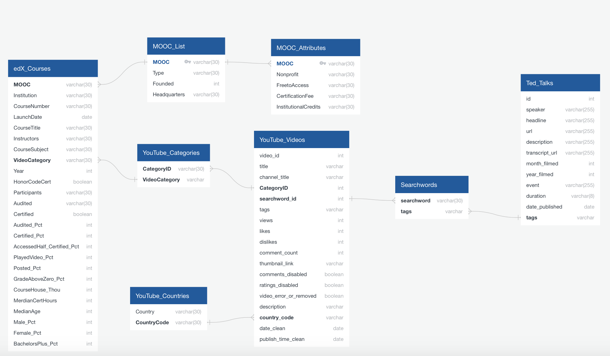

# ETL Process

The COVID-19 pandemic as changed how people around the world live their daily lives. One major area of change is education. In this project we were interested in learning more about the content of online learning platforms. We gathered data from two of the most popular MOOCs (Massive Open Online Courses), EdX and Coursera. We also used data from YouTube use from 10 countries/regions. 

## Step 1 - Extract

#### Data Sources: 
* Harvard and MIT courses offered by EdX (one .csv from Kaggle): https://www.kaggle.com/edx/course-study
* List of MOOCs: https://en.wikipedia.org/wiki/List_of_MOOC_providers
* Attributes of Common MOOCs: https://en.wikipedia.org/wiki/Massive_open_online_course
* YouTube Video Statistics for 10 Countries (.csv from Kaggle): https://www.kaggle.com/datasnaek/youtube-new
* YouTube Video Category IDs for 10 Countries (.json from Kaggle): https://www.kaggle.com/datasnaek/youtube-new

1. Read the .csv files with Pandas read_csv()
2. Read the .json files with Pandas read_json()
3. Extract the Wikipedia tables using Pandas read_html()

## Step 2 - Transform

#### Use the data to create the following tables:
* EdX Courses Offered (FKs: MOOC)
* List of MOOCs (FK: MOOC)
* MOOC Attributes (FK: MOOC)
* YouTube Video Categories (PK & FK: CategoryID)
    -Created unique list of categories and category codes from YouTube Video Category IDs dataset
    -Loaded into new dataframe
* YouTube Countries (PK & FK: CountryCode)
    -Created unique list of countries and country codes from YouTube Video Category IDs dataset
    -Loaded into new dataframe
* YouTube Video Data (FKs: CategoryID & CountryCode)
    -Cleaned date columns from YouTube Video Statistics dataset
    -Loaded into new dataframe
* Master Category Table for YouTube and MOOCs (PK & FK: Master Category)
    -Created unique list of categories (Youtube Video Category IDs dataset) and tags (TEDtalk dataset)
    -Loaded into new dataframe

## Step 3 - Load

1. Create database structure: quickdatabasediagrams.com
2. Create the "online_ed" using PostgreSQL
3. Use the table structures extracted from quickdatabasediagrams.com to define the structure of the database

